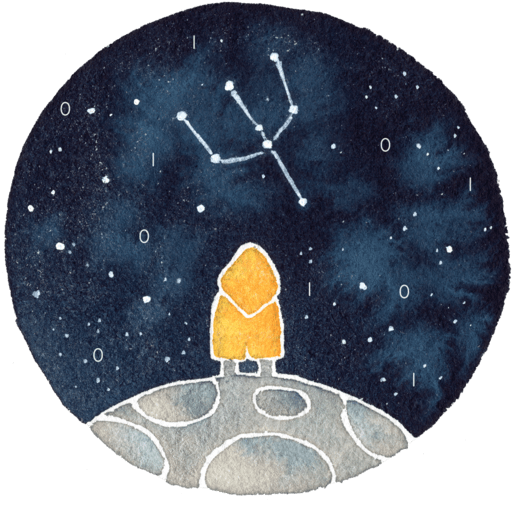

## Hi there, I'm Adrian!

I develop software in the 🧠 psychology field!

Currently, I am researching eye-tracking for infants with [ManyBabies](https://manybabies.github.io/).

I'm also working on <a target="_blank" href="https://draw.study">draw.study</a>, an online platform that teaches concepts using digital drawing exercises. Check out the webapp on your tablet or on Instagram <a target="_blank" href="https://www.instagram.com/drawstudyapp/">@drawstudyapp!</a> 🙂

 
You can check out my <a href="https://adriansteffan.com" target="_blank">website</a>, where I host study resources for my psychology degree.

If you have an interesting project in mind or just want to have a chat, hit me up on my socials or send me an <a href="mailto:adrian.steffan@hotmail.de" target="_blank">e-mail</a>! 

### Education

* MSc. Computer Science (Ongoing)

    

* BSc. Psychology

    

* BSc. Computer Science 

    
     
